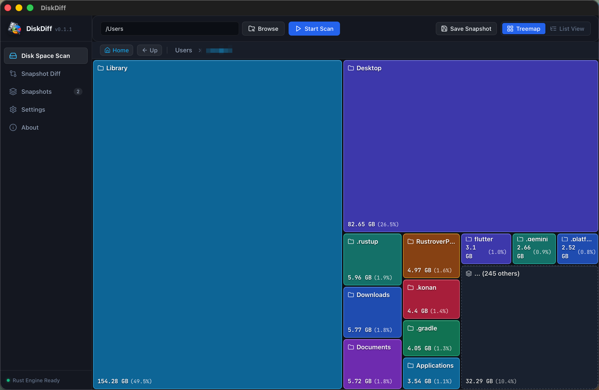
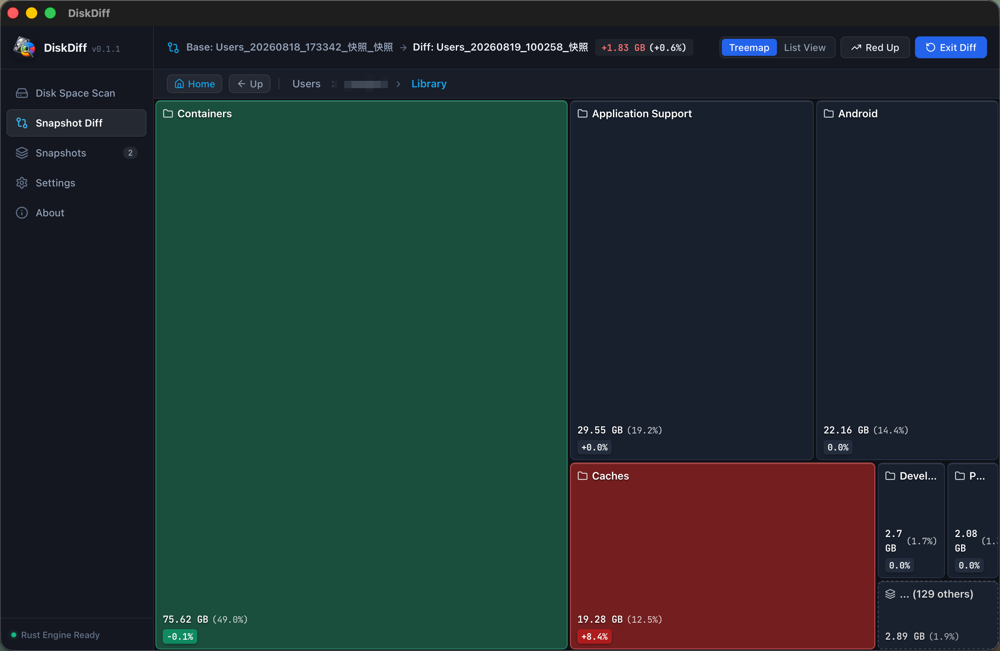

<div align="center">

# 💽 DiskDiff 🦀

**A lightweight, high-performance disk space analyzer and snapshot differential tool.**

[English](README.md) | [简体中文](README_ZH.md)

[](https://www.rust-lang.org/)
[](https://tauri.app/)
[](https://vuejs.org/)
[](LICENSE)
[](#-cross-platform-support)

</div>

---

## 📸 Screenshots

### 1. Disk Space Scan
> High-throughput parallel scanning with bottom-up size rollup, visualized through an intuitive stock-market treemap.



### 2. Snapshot Differential Analysis (Diff)
> Compare any two historical snapshots (or compare directly against active memory scan). Subtree pruning and color heatmaps make spotting bloated files effortless.



---

## 💡 Why DiskDiff?

Disk storage often runs out unexpectedly. While there are many disk analyzer tools available, most of them only show **"which folder is currently the largest"**, but cannot answer **"what exactly grew or changed between last week and today"**.

Traditional folder diff utilities are often clunky, slow, or lack intuitive treemap visual drill-down.

DiskDiff was built with **Rust + Tauri 2.0 + Vue 3** to provide a fast, elegant solution: **take snapshots of any directory, compare them whenever you want, and spot exactly what expanded or shrank using clear stock-market style heatmaps.**

---

## 🚀 Key Features

### 1. ⚡ Multi-Threaded Concurrent Disk Scanning (Rayon)
- **Work-Stealing Pool**: Leverages Rust's Rayon work-stealing thread pool to parallelize directory tree traversal, maximizing modern NVMe SSD IOPS throughput.
- **Bottom-Up Rollup**: Automatically aggregates file sizes, file counts, and subdirectories hierarchically, always ordering largest items first.
- **Throttled Live Feedback**: Emits atomic scan progress updates every 50ms, ensuring silky-smooth UI responsiveness without thread starvation.
- **Symlink & Hardlink Protection**: Detects Unix inodes to prevent duplicate counting of hard links and avoids traversing symlinks to eliminate infinite recursive loops.

### 2. 📈 Stock-Market Style Capacity Treemap
- **Single-Level Drill-Down Architecture**: Custom D3.js squarified treemap rendering only the active directory level with Top-N overflow clustering, handling millions of nodes with ease.
- **Dual Palette Modes**: Supports Chinese stock market style (Red gain / Green loss) and International style (Green gain / Red loss).
- **Multi-View Exploration**: Seamless toggle between responsive Treemap and searchable List View, with one-click "Reveal in Finder / Explorer".

### 3. 🔍 Deep Snapshot Differential Engine (Diff)
- **Subtree Pruning Acceleration**: Skips traversing hundreds of thousands of unchanged nodes instantly when sub-directory metadata matches between snapshots.
- **Parallel Decompression**: Employs `rayon::join` to decompress and deserialize both snapshots concurrently, cutting load latency in half.
- **Multi-Dimensional Metrics**: Computes exact delta sizes ($\Delta \text{size}$) and percentage shifts ($\Delta \%$) for every node.

### 4. 🗜️ High-Compression Binary Snapshot Format (`.snap`)
- **Discrete Metadata Header**: Containerized binary design enables sub-millisecond retrieval of snapshot metadata without decompressing the multi-million node tree.
- **Zstd Level 9 + Bincode**: Compresses millions of nodes into just a few megabytes—saving over 90% space compared to plain text/JSON.

### 5. 🧠 Rust Backend In-Memory Management & Sliced IPC
- **Native Memory Hosting**: Massive directory trees reside directly inside Rust native memory with zero garbage collection overhead.
- **Sliced IPC Delivery**: Frontend Vue queries only the visible viewport slice via Tauri IPC (< 10KB per request), preventing browser UI lag or OOM crashes.

---

## 🖥️ Cross-Platform Support

DiskDiff natively supports major desktop operating systems and architectures:

- **macOS**: Apple Silicon (M1/M2/M3/M4, `arm64`) & Intel (`x86_64`)
- **Windows**: Windows 10 / 11 (`x86_64`)
- **Linux**: Ubuntu / Debian / Arch (`x86_64` & `arm64`)

---

## 🛠️ Development & Build Guide

### 1. Prerequisites
- [Node.js](https://nodejs.org/) (v18+)
- [Rust](https://www.rust-lang.org/) (v1.80+)
- [Tauri 2.0 CLI](https://v2.tauri.app/start/prerequisites/)

### 2. Install Dependencies
```bash
cd gui && npm install
```

### 3. Start Local Development
```bash
npm run tauri dev
```

### 4. Build Release Package
```bash
npm run tauri build
```
The compiled application packages will be generated under `gui/src-tauri/target/release/bundle/`.

---

## 📄 License

This project is licensed under the [MIT License](LICENSE).
